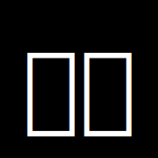

# Hugvi

A modern, desktop-only note-taking app built with [`Tauri`](https://tauri.app) and [`React`](https://react.dev), designed for developers who value simplicity, privacy, and speed.

---

---

## 🚀 What Makes Hugvi Special?

**Hugvi** isn't just another note-taking tool — it's built with a developer-first mindset. Easily manage your code snippets and notes with beautiful, readable syntax highlighting, all in a lightweight desktop app.

### ✅ Features

1.  **Local-First with SQLite**  
   All your data is stored locally using SQLite — your notes are private and truly yours.

2.  **Minimal UI, Maximum Focus**  
   Hugvi follows a _“keep it simple”_ philosophy. No unnecessary features — just what you need to stay productive.

3.  **Multilingual Support**  
   Available in **English**, **German**, and **French**.

4.  **Dark & Light Mode**  
   Seamlessly switch between dark and light themes to match your environment.

---

## ⚙️ Under the Hood

Built with [**Tauri**](https://tauri.app) for a lightweight, secure desktop experience, and powered by [**Rust**](https://www.rust-lang.org) under the hood for blazing-fast performance and native control.

---

> ✏️ Keep your code notes clean, local, and distraction-free — with Hugvi.
